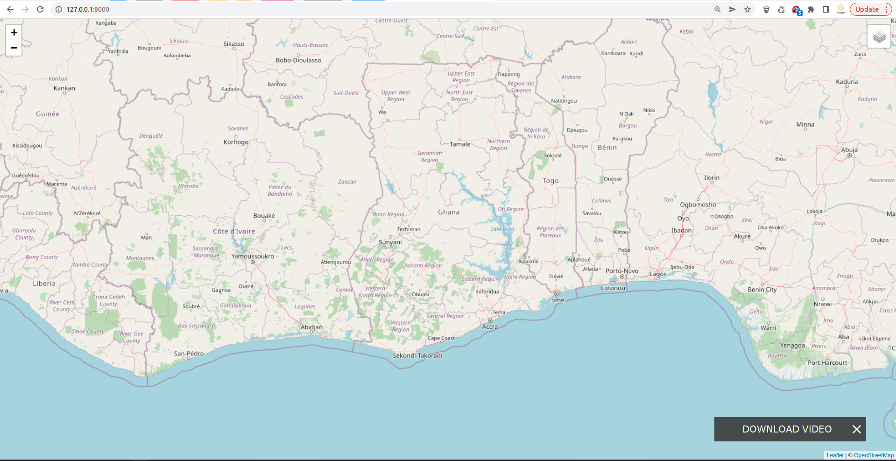
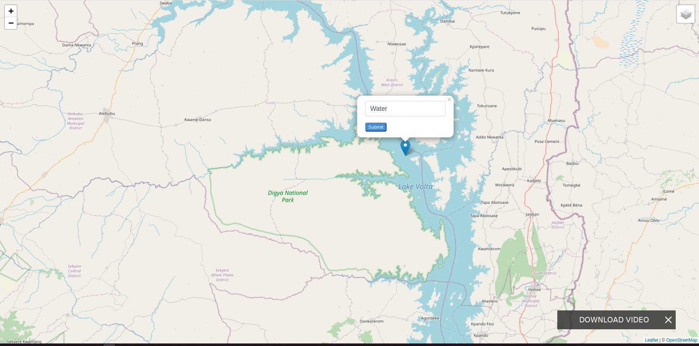

# featurecollector

A simple django application that is used for identifying locations of features on the surface of the earth.
This was purely developed for training purposes.

## Scope

It comes with the following:
- Index map page 	

## Run
- Create a virtual environment for the project.
- Move into the root folder and open your terminal.
- Activate the virtual environment you created.
- Run pip install -r requirements.txt
- Run python manage.py migrate.
- Run python manage.py runserver

Now your app should be running.

TODO:
- Go to the settings.py and change the db to the db with environmment variables.

## Index Page

## Form on map marker

